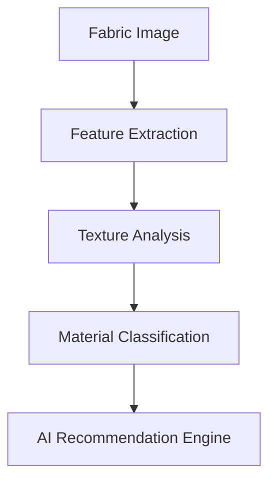

<h1 align="center">Ibrahim Khalil Masud</h1>

<div align="center">


</div>

<div align="center">


</div>

---

# ⚡ Research + Engineering Focus

```python
class IbrahimKhalilMasud:

    def __init__(self):

        self.roles = [
            "AI Systems Engineer",
            "Computer Vision Researcher",
            "Fashion Technology Builder",
            "Workflow Automation Architect"
        ]

        self.focus_areas = [
            "Virtual Try-On Systems",
            "Fabric Intelligence",
            "Human Parsing",
            "Pose Estimation",
            "Generative AI",
            "Autonomous Workflows"
        ]

        self.tech_stack = {
            "AI": ["PyTorch", "TensorFlow", "OpenCV", "Diffusers"],
            "Backend": ["FastAPI", "Flask", "Laravel"],
            "Frontend": ["React", "Vue", "Tailwind"],
            "Infrastructure": ["Docker", "GCP", "GitHub Actions"]
        }

    def philosophy(self):
        return "Build systems that survive real-world deployment."


ibrahim = IbrahimKhalilMasud()

print(ibrahim.philosophy())
```

---

# 🧠 AI / ML Engineering Stack

<div align="center">

| Domain | Technologies |
|---|---|
| AI / ML |  |
| Computer Vision | OpenCV • Detectron2 • MediaPipe • Segment Anything |
| Backend Systems |  |
| Frontend |  |
| Databases |  |
| Infrastructure |  |
| Tools |  |

</div>

---

# 🚀 Flagship AI Systems

<table>
<tr>

<td width="50%" valign="top">

## 👗 AI Virtual Try-On Platform

Computer vision pipeline focused on:

- garment transfer
- body alignment
- segmentation
- pose correction
- realistic apparel rendering

### Core Stack

```yaml
Framework:
  - PyTorch
  - OpenCV
  - Diffusers

Vision:
  - Human Parsing
  - Pose Estimation
  - Segmentation Models

Deployment:
  - FastAPI
  - Docker
  - GCP
```

</td>

<td width="50%" valign="top">

## 🧵 Fabric Intelligence Engine

AI-driven textile analysis system for:

- material classification
- texture recognition
- drape understanding
- fabric behavior analysis

### Pipeline



</td>

</tr>
</table>

---

# 🏗️ Smart Operations Infrastructure

```bash
> booting intelligent operational systems...

✓ AI workflow orchestration
✓ Smart office automation
✓ Autonomous task pipelines
✓ Research infrastructure systems
✓ Real-time monitoring dashboards
✓ Scalable deployment architecture

SYSTEM STATUS: ACTIVE
```

---

# 📊 GitHub Analytics

<div align="center">


</div>

<div align="center">


</div>

<div align="center">


</div>

---

# ⚙️ Current Research Directions

```txt
[01] AI Fashion Intelligence
[02] Virtual Dressing Systems
[03] Fabric Simulation
[04] Pose Estimation
[05] Human Parsing
[06] Generative AI Infrastructure
[07] Workflow Intelligence Systems
[08] Autonomous Operational AI
```

---

# 🧬 Engineering Philosophy

```txt
I prefer systems over hype.

The objective is not experimental demos.
The objective is deployable intelligence:

- scalable architecture
- reliable infrastructure
- usable interfaces
- measurable operational value

Research matters when it survives production.
```

---

# 🌐 Connect

<div align="center">

<a href="https://linkedin.com/in/muhammad-ibrahim-khalil-03686978/">
  
</a>

<a href="https://facebook.com/ibrahimkhalilmasudik">
  
</a>

<a href="https://buymeacoffee.com/MDIbrahim">
  
</a>

</div>

---

# 🐍 Dynamic Contributions

<div align="center">


</div>

<div align="center">


</div>

---

<div align="center">

```diff
+ Building intelligent systems for the future of AI, fashion, and automation.
```

</div>
